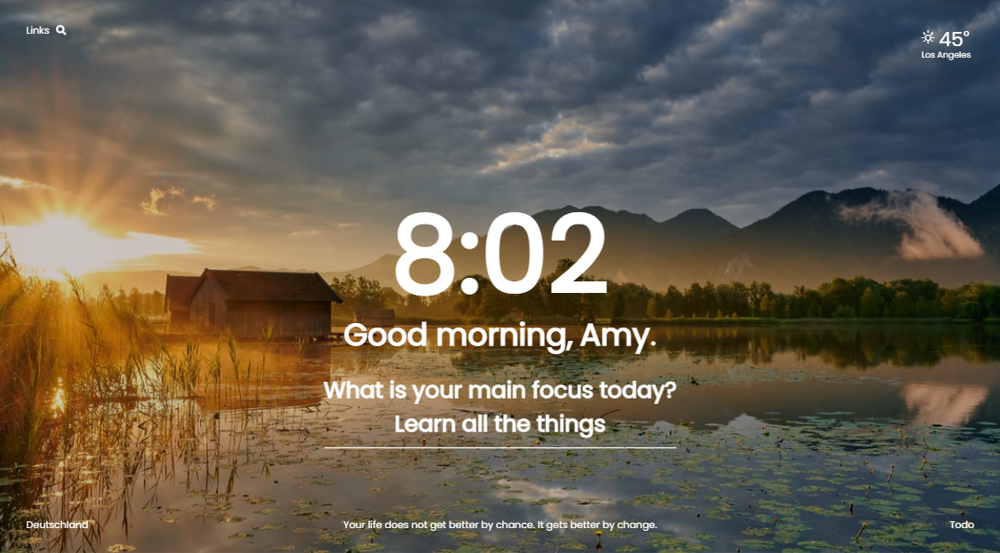

# Momentum Clone



> Momentum Clone Application built with React.js and Node.js.

---

### Table of Contents

- [Description](#description)
- [How To Use](#how-to-use)
- [API References](#references)
- [License](#license)

---

## Description

This clone application based on the Chrome Momentum productivity application. This application uses the Google, Yahoo, and Bing search engines, local storage to save user preferences, and a proxy server to facilitate requests to third-party API's.

#### Public API's

- Unsplash API
- Openweather API
- They Said So Quotes API

#### Technologies

- React : v17.0.2
- Node : v14.15.4
- Express : v4.17.1
- CSS3

---

## How To Use

Install Concurrently at project root:

```
npm install -D concurrently
```

In the root package.json:

```
  "scripts": {
    "scripts": "node backend/server.js",
    "server": "nodemon backend/server.js",
    "client": "npm start --prefix client",
    "clientinstall": "npm install --prefix client",
    "dev": "concurrently \"npm run server\" \"npm run client\""
  }
```

In the client package.json:

```
  "proxy": "http://localhost:5000"
```

To run:

```
npm run dev
```

[Back To Top](#ultimate-herb-finder)

---

## API References

To fetch data from API, create variables in the root .env file for each third-party API:

```
API_BASE_URL = https://api.unsplash.com/photos/random
API_UNSPLASH_KEY = "Your API Key"
```

In the relevant route file, i.e. background.js:

```
try {

    const params = new URLSearchParams({
        client_id : process.env.API_UNSPLASH_KEY,
        ...url.parse(req.url, true).query
    })

    const apiRes = await needle('get', `${process.env.API_UNSPLASH_URL}?${params}`)

    const data = apiRes.body
    res.status(200).json(data)

} catch (error) {
    res.status(500).json({error})
}
```

---

## License

This project is licensed under the [MIT License](#LICENSE.txt)

Copyright (c) 2021 [Amelia Hill](#https://ameliahill.com)
